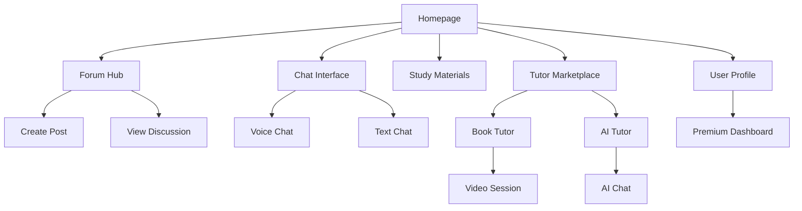

## 1. Product Overview

A comprehensive online learning platform that connects students to collaborate, share educational materials, and learn together through voice chat, forums, and tutoring services. Students can ask questions, earn points for contributions, maintain chat streaks, and access premium tutoring features with AI assistance.

The platform solves the problem of isolated learning by creating a collaborative environment where students help each other succeed academically while building a supportive community through gamification and professional tutoring support.

## 2. Core Features

### 2.1 User Roles

| Role            | Registration Method       | Core Permissions                                                |
| --------------- | ------------------------- | --------------------------------------------------------------- |
| Student         | Email/Social registration | Create forums, chat, voice calls, earn points, access materials |
| Premium Student | Subscription upgrade      | Access premium tutors, priority support, advanced features      |
| Tutor           | Verification process      | Create paid sessions, set rates, manage bookings                |
| AI Tutor        | System service            | 24/7 automated tutoring assistance                              |

### 2.2 Feature Module

Our student learning platform consists of the following main pages:

1. **Homepage**: Navigation, trending forums, featured materials, user stats
2. **Forum Hub**: Browse categories, create posts, view discussions, search
3. **Chat Interface**: Text/voice chat, user list, streak counter, file sharing
4. **Study Materials**: Upload/download resources, rate materials, organize by subject
5. **Tutor Marketplace**: Browse tutors, book sessions, manage appointments
6. **AI Tutor**: Interactive learning assistant, subject selection, progress tracking
7. **User Profile**: Statistics, achievements, points, streaks, settings
8. **Premium Dashboard**: Subscription management, exclusive features

### 2.3 Page Details

| Page Name         | Module Name             | Feature description                                       |
| ----------------- | ----------------------- | --------------------------------------------------------- |
| Homepage          | Navigation Bar          | Access all platform sections with user-friendly menu      |
| Homepage          | Trending Forums         | Display most active discussions with engagement metrics   |
| Homepage          | User Stats              | Show current points, streaks, and recent activity         |
| Forum Hub         | Category Browser        | Filter discussions by subject, difficulty, popularity     |
| Forum Hub         | Post Creator            | Create questions with text, images, and subject tags      |
| Forum Hub         | Discussion View         | Read replies, upvote helpful answers, earn points         |
| Chat Interface    | Voice Chat              | Real-time voice communication with push-to-talk           |
| Chat Interface    | Text Chat               | Send messages, share files, maintain conversation history |
| Chat Interface    | Streak Counter          | Display consecutive days of active chatting               |
| Study Materials   | Upload System           | Share PDFs, notes, presentations with preview             |
| Study Materials   | Download Center         | Access community-shared resources with ratings            |
| Tutor Marketplace | Tutor Profiles          | View qualifications, ratings, subjects, hourly rates      |
| Tutor Marketplace | Booking System          | Schedule sessions, make payments, join video calls        |
| AI Tutor          | Subject Selection       | Choose topic for personalized AI assistance               |
| AI Tutor          | Interactive Chat        | Ask questions, receive explanations, practice problems    |
| User Profile      | Achievement System      | Display badges for contributions and activity             |
| User Profile      | Statistics Dashboard    | Track points earned, helpful answers given                |
| Premium Dashboard | Subscription Management | Upgrade/downgrade plans, payment history                  |
| Premium Dashboard | Exclusive Features      | Access premium tutors and advanced AI capabilities        |

## 3. Core Process

### Student Learning Flow

Students begin by registering and selecting their academic interests. They can immediately start browsing forums to find discussions relevant to their studies. When encountering difficulties, students create forum posts detailing their questions, optionally attaching images or documents. Other students respond with explanations, earning points for helpful answers. Active participants build chat streaks through regular voice/text conversations with study partners.

Students seeking additional help can browse the tutor marketplace, filtering by subject expertise, ratings, and pricing. After booking and paying for sessions, they join video calls with tutors for personalized instruction. The AI tutor provides 24/7 support for quick questions and practice exercises, adapting to each student's learning pace.

### Premium User Flow

Premium subscribers access exclusive features including priority tutor matching, extended AI tutor sessions, and advanced analytics on their learning progress. They can book group study sessions and access premium educational content uploaded by verified educators.

### Tutor Flow

Verified tutors create detailed profiles showcasing their qualifications, subjects taught, and hourly rates. They set availability schedules and manage booking requests. During sessions, tutors use integrated video conferencing and screen sharing tools. Payments are processed automatically after completed sessions, with platform commission deducted.

## 4. User Interface Design

### 4.1 Design Style

- **Primary Colors**: Deep blue (#2563EB) for headers, bright green (#10B981) for success/actions
- **Secondary Colors**: Light gray (#F3F4F6) backgrounds, white cards with subtle shadows
- **Button Style**: Rounded corners (8px radius), gradient hover effects, clear call-to-action colors
- **Typography**: Inter font family, 16px base size, clear hierarchy with bold headers
- **Icon Style**: Modern line icons (Heroicons), consistent stroke width, intuitive symbols
- **Layout**: Card-based design with generous spacing, mobile-responsive grid system

### 4.2 Page Design Overview

| Page Name         | Module Name         | UI Elements                                                   |
| ----------------- | ------------------- | ------------------------------------------------------------- |
| Homepage          | Navigation Bar      | Sticky header with logo, search bar, user avatar dropdown     |
| Homepage          | Trending Forums     | Card grid with preview text, author info, engagement counters |
| Homepage          | User Stats          | Circular progress indicators for points and streaks           |
| Forum Hub         | Category Browser    | Sidebar filter with checkbox selections, tag clouds           |
| Forum Hub         | Discussion View     | Threaded comments with upvote buttons, reply forms            |
| Chat Interface    | Voice Controls      | Large push-to-talk button, volume indicators                  |
| Chat Interface    | Message Feed        | Bubble-style messages with timestamps, typing indicators      |
| Tutor Marketplace | Tutor Cards         | Profile photos, star ratings, subject tags, pricing           |
| AI Tutor          | Chat Window         | Clean message interface with subject selector dropdown        |
| User Profile      | Achievement Display | Badge collection with hover tooltips, progress bars           |

### 4.3 Responsiveness

Desktop-first design with mobile adaptation. Primary navigation collapses to hamburger menu on tablets/phones. Chat interface switches to full-screen mode on mobile. Touch-optimized buttons with 44px minimum touch targets. Responsive typography scaling for optimal readability across devices.

### 4.4 3D Scene Guidance

Not applicable for this educational platform design.
