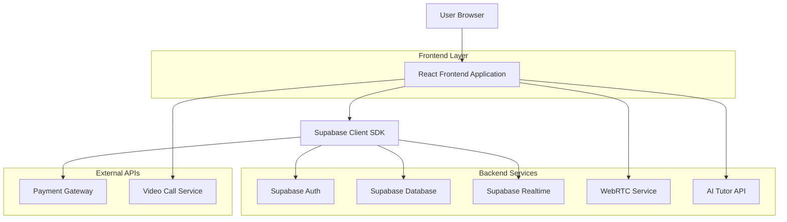
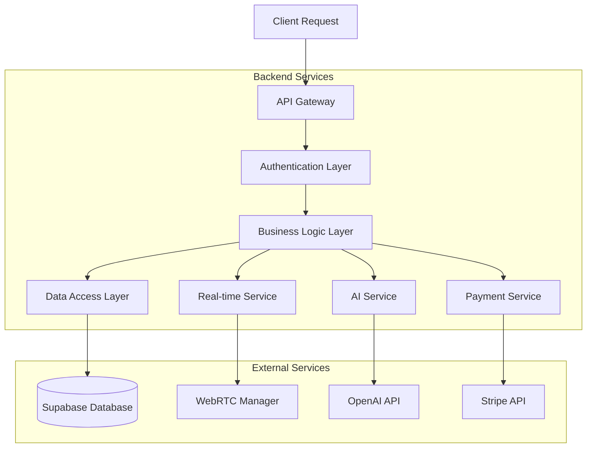
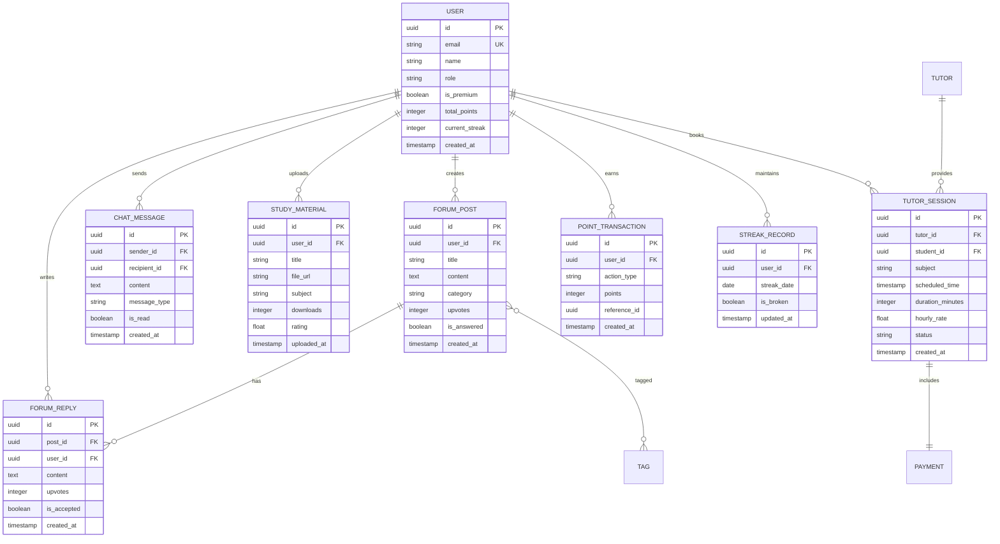

## 1. Architecture design



## 2. Technology Description

- **Frontend**: React@18 + tailwindcss@3 + vite
- **Initialization Tool**: vite-init
- **Backend**: Supabase (Authentication, PostgreSQL, Realtime, Storage)
- **Real-time Communication**: WebRTC for voice chat, Socket.io for text chat
- **AI Integration**: OpenAI API for AI tutor functionality
- **Payment Processing**: Stripe for premium subscriptions and tutor payments

## 3. Route definitions

| Route             | Purpose                                                    |
| ----------------- | ---------------------------------------------------------- |
| /                 | Homepage with trending content and user dashboard          |
| /forums           | Browse and search educational forums by category           |
| /forums/:id       | View specific forum discussion and replies                 |
| /forums/create    | Create new forum post with rich text editor                |
| /chat             | Main chat interface with user list and voice/text options  |
| /chat/:userId     | Private chat with specific user, maintains streak tracking |
| /materials        | Browse and search shared educational materials             |
| /materials/upload | Upload new study materials with metadata                   |
| /tutors           | Browse available tutors with filtering and search          |
| /tutors/:id       | View tutor profile, ratings, and booking options           |
| /ai-tutor         | Interactive AI tutoring interface with subject selection   |
| /profile          | User profile with statistics, achievements, and settings   |
| /premium          | Premium subscription management and features               |
| /auth/login       | User authentication with email/social login                |
| /auth/register    | New user registration with profile setup                   |

## 4. API definitions

### 4.1 Authentication APIs

```
POST /api/auth/register
```

Request:
| Param Name | Param Type | isRequired | Description |
|------------|------------|------------|-------------|
| email | string | true | User email address |
| password | string | true | User password (min 8 characters) |
| name | string | true | Display name |
| role | string | false | 'student' or 'tutor' (default: student) |

Response:
| Param Name | Param Type | Description |
|------------|------------|-------------|
| user | object | User object with id and profile data |
| session | object | Authentication session token |

### 4.2 Forum APIs

```
GET /api/forums
```

Query Parameters:
| Param Name | Param Type | isRequired | Description |
|------------|------------|------------|-------------|
| category | string | false | Filter by subject category |
| search | string | false | Search in titles and content |
| sort | string | false | 'popular', 'recent', 'unanswered' |
| limit | number | false | Number of results (default: 20) |

```
POST /api/forums
```

Request:
| Param Name | Param Type | isRequired | Description |
|------------|------------|-------------|
| title | string | true | Forum post title |
| content | string | true | Post content with markdown support |
| category | string | true | Subject category |
| tags | array | false | Array of topic tags |

### 4.3 Chat APIs

```
POST /api/chat/message
```

Request:
| Param Name | Param Type | isRequired | Description |
|------------|------------|-------------|
| recipientId | string | true | Target user ID |
| content | string | true | Message content |
| type | string | false | 'text' or 'voice' (default: text) |

### 4.4 Points/Streaks APIs

```
POST /api/points/earn
```

Request:
| Param Name | Param Type | isRequired | Description |
|------------|------------|-------------|
| action | string | true | 'forum_answer', 'material_upload', 'helpful_vote' |
| targetId | string | true | ID of related content |

### 4.5 Tutor APIs

```
GET /api/tutors/available
```

Query Parameters:
| Param Name | Param Type | isRequired | Description |
|------------|------------|-------------|
| subject | string | false | Subject filter |
| priceMin | number | false | Minimum hourly rate |
| priceMax | number | false | Maximum hourly rate |
| rating | number | false | Minimum rating filter |

```
POST /api/tutors/book
```

Request:
| Param Name | Param Type | isRequired | Description |
|------------|------------|-------------|
| tutorId | string | true | Tutor user ID |
| datetime | string | true | ISO date/time for session |
| duration | number | true | Session duration in minutes |
| subject | string | true | Subject for tutoring |

### 4.6 AI Tutor APIs

```
POST /api/ai-tutor/chat
```

Request:
| Param Name | Param Type | isRequired | Description |
|------------|------------|-------------|
| message | string | true | Student's question |
| subject | string | true | Academic subject |
| context | array | false | Previous conversation context |

## 5. Server architecture diagram



## 6. Data model

### 6.1 Data model definition



### 6.2 Data Definition Language

User Table (users)

```sql
-- create table
CREATE TABLE users (
    id UUID PRIMARY KEY DEFAULT gen_random_uuid(),
    email VARCHAR(255) UNIQUE NOT NULL,
    password_hash VARCHAR(255) NOT NULL,
    name VARCHAR(100) NOT NULL,
    role VARCHAR(20) DEFAULT 'student' CHECK (role IN ('student', 'tutor')),
    is_premium BOOLEAN DEFAULT false,
    total_points INTEGER DEFAULT 0,
    current_streak INTEGER DEFAULT 0,
    created_at TIMESTAMP WITH TIME ZONE DEFAULT NOW(),
    updated_at TIMESTAMP WITH TIME ZONE DEFAULT NOW()
);

-- create indexes
CREATE INDEX idx_users_email ON users(email);
CREATE INDEX idx_users_role ON users(role);
CREATE INDEX idx_users_points ON users(total_points DESC);
```

Forum Posts Table (forum_posts)

```sql
-- create table
CREATE TABLE forum_posts (
    id UUID PRIMARY KEY DEFAULT gen_random_uuid(),
    user_id UUID REFERENCES users(id) ON DELETE CASCADE,
    title VARCHAR(255) NOT NULL,
    content TEXT NOT NULL,
    category VARCHAR(50) NOT NULL,
    upvotes INTEGER DEFAULT 0,
    is_answered BOOLEAN DEFAULT false,
    created_at TIMESTAMP WITH TIME ZONE DEFAULT NOW(),
    updated_at TIMESTAMP WITH TIME ZONE DEFAULT NOW()
);

-- create indexes
CREATE INDEX idx_forum_posts_user_id ON forum_posts(user_id);
CREATE INDEX idx_forum_posts_category ON forum_posts(category);
CREATE INDEX idx_forum_posts_created_at ON forum_posts(created_at DESC);
```

Chat Messages Table (chat_messages)

```sql
-- create table
CREATE TABLE chat_messages (
    id UUID PRIMARY KEY DEFAULT gen_random_uuid(),
    sender_id UUID REFERENCES users(id) ON DELETE CASCADE,
    recipient_id UUID REFERENCES users(id) ON DELETE CASCADE,
    content TEXT NOT NULL,
    message_type VARCHAR(20) DEFAULT 'text' CHECK (message_type IN ('text', 'voice')),
    is_read BOOLEAN DEFAULT false,
    created_at TIMESTAMP WITH TIME ZONE DEFAULT NOW()
);

-- create indexes
CREATE INDEX idx_chat_messages_sender ON chat_messages(sender_id);
CREATE INDEX idx_chat_messages_recipient ON chat_messages(recipient_id);
CREATE INDEX idx_chat_messages_created_at ON chat_messages(created_at DESC);
```

Points System Table (point_transactions)

```sql
-- create table
CREATE TABLE point_transactions (
    id UUID PRIMARY KEY DEFAULT gen_random_uuid(),
    user_id UUID REFERENCES users(id) ON DELETE CASCADE,
    action_type VARCHAR(50) NOT NULL CHECK (action_type IN ('forum_answer', 'material_upload', 'helpful_vote', 'streak_bonus')),
    points INTEGER NOT NULL,
    reference_id UUID,
    created_at TIMESTAMP WITH TIME ZONE DEFAULT NOW()
);

-- create indexes
CREATE INDEX idx_points_user_id ON point_transactions(user_id);
CREATE INDEX idx_points_created_at ON point_transactions(created_at DESC);
```

-- Grant permissions
GRANT SELECT ON ALL TABLES TO anon;
GRANT ALL PRIVILEGES ON ALL TABLES TO authenticated;

-- Row Level Security (RLS) policies
ALTER TABLE forum_posts ENABLE ROW LEVEL SECURITY;
ALTER TABLE chat_messages ENABLE ROW LEVEL SECURITY;
ALTER TABLE point_transactions ENABLE ROW LEVEL SECURITY;

-- Example RLS policy for forum posts
CREATE POLICY "Users can view all posts" ON forum_posts FOR SELECT USING (true);
CREATE POLICY "Users can create their own posts" ON forum_posts FOR INSERT WITH CHECK (auth.uid() = user_id);
CREATE POLICY "Users can update their own posts" ON forum_posts FOR UPDATE USING (auth.uid() = user_id);
